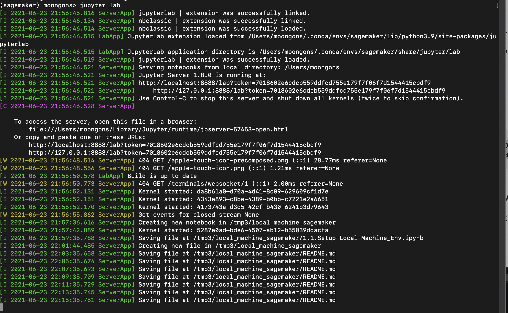
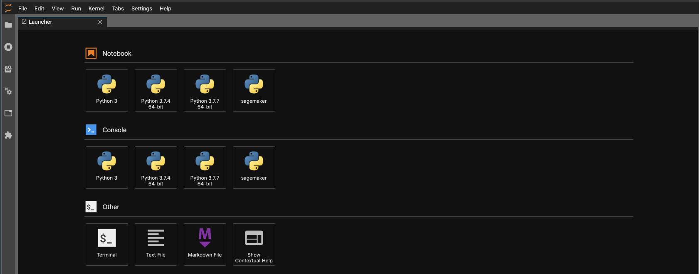

# 로컬 머신 쥬피터 랩 환경 설정
- 아래 설치는 이 링크를 참조했습니다. 원문을 보시면서 하는 것을 권장 합니다. [Setting up Amazon SageMaker Environment On Your Local Machine](https://towardsdatascience.com/setting-up-amazon-sagemaker-environment-on-your-local-machine-7329e0178adc) 

- Mac O/S 기반에 설치 및 테스트를 완료 하였습니다.

## 1. conda 설치가 안되어 있으면 아래 링크 참조하여 설치
    
- [콘다 설치](https://docs.conda.io/projects/conda/en/latest/user-guide/install/index.html)
    
    
## 2. conda 환경 설치

- 터미널을 열고 아래 명령어를 실행하세요
    - `conda create -n sagemaker python=3`

- conda 환경 활성화
    - `conda activate sagemaker`

- 추가 파이썬 패키지 설치
    - `conda install -y pandas numpy matplotlib`
    
    
- AWS 패키지 설치
    - `pip install boto3 awscli sagemaker`

- 쥬피터 설치 및 커널 생성
    - `conda install -c conda-forge jupyterlab
python -m ipykernel install --user --name sagemaker`

## 3. 쥬피터 랩 실행

- 쥬피터 랩 실행
    - `jupyter lab`
    - 아래와 같이 실행이 되어야 합니다.
        - 

    
- 쥬피터 랩 화면 보임
    - 
    
    
## 4.샘플코드 Git Repository 다운로드

    - git clone https://github.com/gonsoomoon-ml/Use-SageMaker-On-Local-Machine
    
    
### 4.1 파일 구성
- 2.0.Setup-SageMaker-Kernel-Env.ipynb
    - SageMaker 커널에 파이썬 패키징 설치
    
    
- 2.1.local_train.ipynb
    - 로컬에서 훈련 잡 실행
    
- 2.2.no_sagemaker_session_.local_train.ipynb
    - 세이지 메이커 세션 없이 훈련 잡 실행
    
    
## 참조 자료
- Setting up Amazon SageMaker Environment On Your Local Machine
    - 아래 블로그에서 로컬 환경 세팅만 진행
    - https://towardsdatascience.com/setting-up-amazon-sagemaker-environment-on-your-local-machine-7329e0178adc
- Train with Amazon SageMaker on your local machine
    - 환경 셋업이 완료된 후에 코드만 수행
    - https://www.youtube.com/watch?v=K3ngZKF31mc    